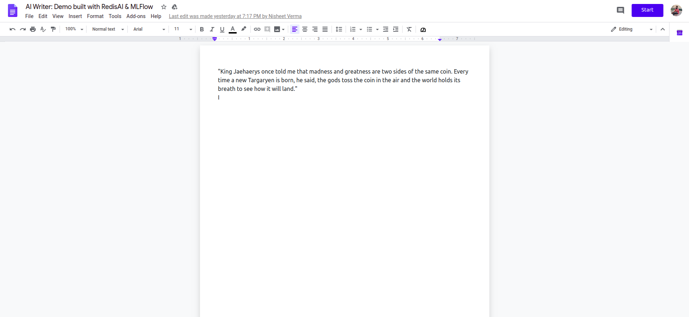

# RedisAI MLflow Demo
A Demo showing RedisAI-MLflow integration

This is a self contained demo built on Flask server that servers both frontend and backend. The server needs 
RedisAI instance running on the default port and on the same host. Follow the below steps for setting up and 
running the demo. But a detailed walk through is available at [medium.com]()

## Steps

* Run a RedisAI instance. You can follow the [documentation](https://oss.redislabs.com/redisai/) for this but
for quickly spinning up a RedisAI server, use the official docker image

```shell script
docker run -p 6379:6379 redisai/redisai:latest
```  

* Clone this repository and make a conda environment from the given `yml` file and activate it

```shell script
conda env create -f env.yml
conda activate redisai_mlflow_demo
```

* Train the model and save it as `torchscript` model in MLflow. MLflow runs the `train.py` file which mock
the training for the sake of this example and save the trained `torchscript` model.

```shell script
mlflow run . --no-conda
```

* Deploy the trained model into RedisAI. For this, you need the Run ID from the previous step.

```shell script
mlflow deployments create -t redisai -m runs:/<RUN ID PLACEHOLDER>/model --name gptmodel
```

* Now that MLflow has deployed the model in RedisAI, we can bring up our Flask application. It is a self
contained application that serves both frontend and backend

```shell script
cd server
flask run
```

* Go to the URL `http://127.0.0.1:5000/` and you should see a UI similar to the one given below. Click on the
`Start` button on top right and see the AI in action

